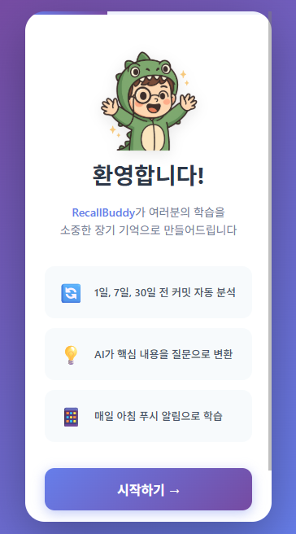
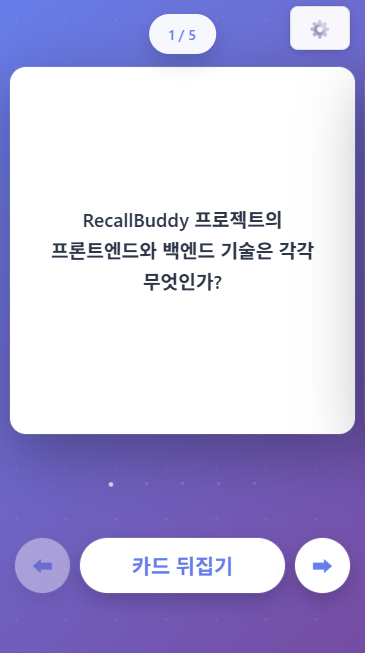
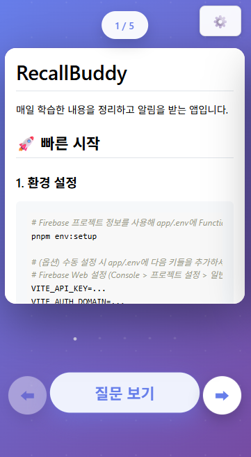
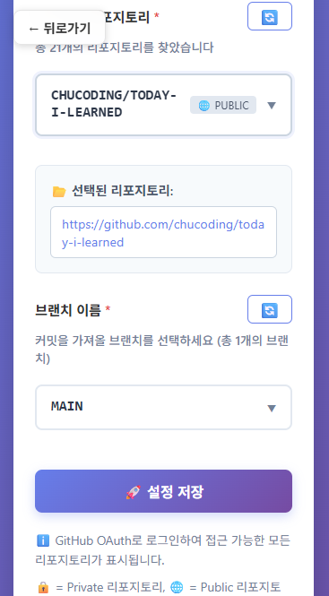

# RecallBuddy
https://til-alarm.web.app/

매일 github에서 학습하거나 커밋한 내용을 정리하고 알림을 받는 앱입니다.

<p align="center">
  
  
  
  
</p>

## 🚀 시작하기

### 필수 요구사항
- Node.js 22+
- pnpm (패키지 매니저)

### 1. 온보딩

#### 1.1. 환경 설정

##### app/.env
Firebase Web 설정 (Console > 프로젝트 설정 > 일반 > 웹 앱 구성에서 복사)
```bash
VITE_API_KEY=...
VITE_AUTH_DOMAIN=...
VITE_PROJECT_ID=...
VITE_STORAGE_BUCKET=...
VITE_MESSAGING_SENDER_ID=...
VITE_APP_ID=...
VITE_MEASUREMENT_ID=...
```
#### functions/.env
```bash
CLOVA_API_KEY=your_clova_api_key
```

##### Firebase 초기화
```bash
firebase login
firebase init
```

#### 1.2. 프로젝트 셋팅
```bash
pnpm install
```

#### 1.3. 프록시 서버 셋팅
```bash
pnpm proxy
```

### 2. 개발 서버 시작
```bash
# BE
pnpm serve

# FE
pnpm dev
```

### 3. 빌드
```bash
pnpm build
```

### 4. 배포
```bash
pnpm push
```

## 🌏 리전

이 프로젝트는 기본적으로 **Seoul (asia-northeast3)** 리전에 배포됩니다.

[전체 리전 목록 보러가기](https://firebase.google.com/docs/functions/locations)


## 기술 스택

<div align=left>
  
  
  
  
  
</div>
<br>

## 기술 블로그
|version|date|link|
|---|---|---|
|v2.0|2025.10.20|[RecallBuddy 2.0 개발 후기](https://chucoding.tistory.com/163)|
|v1.2|2024.03.03|[HyperCLOVA X를 활용한 공부앱 만들기](https://chucoding.tistory.com/137)|
|v1.0|2023.11.19|[네이버클라우드 서비스를 활용한 알림(PUSH) 앱 배포하기](https://chucoding.tistory.com/130)|
|v1.0|2023.10.15|[안드로이드, IOS 지식 없이 SENS로 알림(PUSH) 서비스 개발하기](https://chucoding.tistory.com/129)|

## 라이센스

<a href="https://www.linkedin.com/in/chucoding/" target="_blank">Prod By. 외계공룡</a><br/>
Copyright &copy; RecallBuddy<br/>All Rights Reserved.</p>